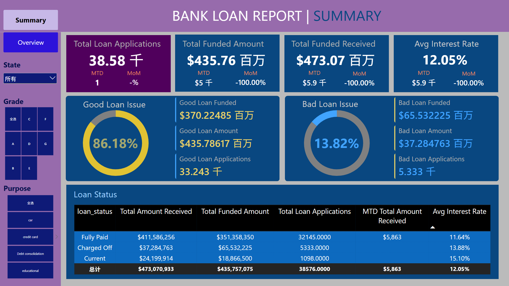
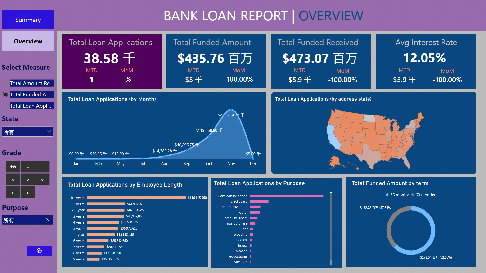

# Financial Loan Data Analysis & Power BI Dashboard

> MySQL 数据分析 + Power BI 数据建模 + DAX 动态指标，通过贷款规模、资金回收、贷款质量和客户结构等维度分析金融贷款业务表现。

---

## 📊 Dashboard Preview

| 1. Loan Summary                          | 2. Loan Overview                           |
| ---------------------------------------- | ------------------------------------------ |
|  |  |

---

# 一、项目简介

本项目基于金融贷款业务数据，使用 **MySQL + Power BI + DAX** 对贷款申请、放款金额、回款金额、利率、债务收入比以及贷款状态等指标进行分析，并搭建交互式贷款业务 Dashboard。

分析主要围绕三个业务问题展开：

1. **业务规模如何变化？**
   通过贷款申请量、放款金额、回款金额以及 MTD / MoM 指标监控业务规模及月度变化。

2. **当前贷款资产质量如何？**
   根据贷款状态划分 Good Loan 与 Bad Loan，对比贷款数量、放款金额和回款金额。

3. **贷款业务主要由哪些客户和需求构成？**
   从地区、贷款期限、就业年限、贷款用途等维度分析贷款业务结构，为客户分层、产品设计和风险管理提供参考。

最终建立 **Summary + Overview** 两层 Power BI 分析体系：

> **核心 KPI → 贷款质量 → 时间趋势 → 客户与业务结构**

---

# 二、技术栈

| 工具              | 用途                                  |
| --------------- | ----------------------------------- |
| **MySQL**       | 数据查询、业务指标计算与结果验证                    |
| **DBeaver**     | 数据库连接、SQL 查询及数据检查                   |
| **Power BI**    | 数据建模与交互式 Dashboard                  |
| **DAX**         | KPI、MTD、MoM、Good / Bad Loan 等动态指标计算 |

---

# 三、核心数据字段

数据主要包含贷款申请信息、客户属性、贷款状态及资金表现。

| 字段               | 业务含义   |
| ---------------- | ------ |
| `id`             | 贷款申请编号 |
| `issue_date`     | 贷款发放日期 |
| `loan_amount`    | 贷款金额   |
| `total_payment`  | 累计回款金额 |
| `int_rate`       | 贷款利率   |
| `dti`            | 债务收入比  |
| `loan_status`    | 贷款状态   |
| `term`           | 贷款期限   |
| `address_state`  | 客户所在地区 |
| `emp_length`     | 就业年限   |
| `purpose`        | 贷款用途   |
| `annual_income`  | 客户年收入  |
| `home_ownership` | 住房情况   |

---

# 四、数据模型

Power BI 模型主要由两张核心表构成：

### financial_loan

贷款业务事实表，保存贷款申请、客户属性、贷款状态和资金信息。

### Date Table

独立日期维度表，与 `financial_loan` 中的贷款发放日期建立关联，用于计算：

* MTD（Month-to-Date）
* 上月指标
* MoM（Month-over-Month）
* 月度趋势

通过日期维度表而不是直接使用事实表日期，可以统一时间分析口径，并支持后续扩展 YTD、同比等时间智能指标。

---

# 五、核心 KPI

Summary 页面首先建立贷款业务的核心指标体系。

| 核心指标 | 含义 | 业务作用 |
|---|---|---|
| Total Loan Applications | 贷款申请总量 | 用于衡量贷款业务整体规模 |
| Total Funded Amount | 累计放款金额 | 反映金融机构实际投放的贷款资金规模 |
| Total Amount Received | 累计回款金额 | 用于观察贷款资金回收表现 |
| Average Interest Rate | 平均信贷利率 | 反映当前贷款组合整体利率水平 |
| Average DTI | Debt-to-Income Ratio | 反映借款人债务负担与收入之间的比例 |

---

# 六、Overview 多维业务分析

Overview 页面进一步拆解贷款业务结构，并通过动态指标实现不同业务指标之间的切换分析。

## 1. Monthly Trend

按照贷款发放月份分析业务变化趋势。

可观察：

* 贷款申请量变化
* 放款金额变化
* 回款金额变化
* 不同月份业务规模差异

该分析用于判断贷款业务是否存在明显的增长、下降或季节性变化。

---

## 2. Regional Analysis

按照 `address_state` 分析不同地区的贷款业务分布。

用于识别：

* 贷款需求集中地区
* 不同地区业务规模差异
* 潜在的区域市场集中度

需要注意：

> 地区贷款量较高并不直接代表地区风险较高。

如果要判断地区风险，还需要进一步结合 Bad Loan Rate、DTI、收入和贷款金额等指标。

---

## 3. Loan Term Analysis

按照 `term` 比较不同贷款期限的业务结构。

例如：

* 36 months
* 60 months

贷款期限会影响客户月度还款压力、利息支出以及金融机构的资金占用周期，因此是贷款产品结构分析的重要维度。

---

## 4. Employment Length Analysis

按照 `emp_length` 分析不同就业年限客户的贷款业务规模。

就业年限可以一定程度反映客户职业稳定性，但不能单独作为信用风险判断依据。

因此该指标更适合作为客户画像变量，并与：

* DTI
* Annual Income
* Loan Amount
* Loan Status

结合分析。

---

## 5. Loan Purpose Analysis

按照 `purpose` 分析客户贷款用途。

数据中的贷款用途包括债务整合、信用卡、住房改善、个人消费等不同需求。

该维度能够帮助回答：

> **客户为什么借款？**

进一步结合贷款状态后，可以用于判断不同贷款用途对应的业务规模和潜在风险差异。

---

#  七、主要业务结论

1. **贷款业务整体呈增长趋势**
   - 从月度趋势来看，贷款申请量整体随时间上升，说明样本期内贷款业务规模持续扩大。
   - 建议结合 MTD 与 MoM 指标持续监控业务增速，识别增长放缓或异常波动月份。

2. **贷款组合整体以 Good Loan 为主**
   - 从贷款状态分类来看，Good Loan 在贷款申请中占据主要部分，Bad Loan 占比较低。
   - 但贷款质量不能只观察贷款笔数，还需要同时关注 Bad Loan 对应的放款金额和回款金额，以评估实际资金风险敞口。

3. **贷款需求存在明显的地域集中**
   - 不同州的贷款申请规模存在明显差异，说明贷款业务具有一定的区域集中性。
   - 对贷款规模较大的地区，可进一步结合 Bad Loan Rate、平均 DTI 等指标判断其属于“高规模低风险”还是“高规模高风险”市场。

4. **规模增长与风险控制需要同步**
   - 申请量和放款金额衡量业务扩张，Good/Bad Loan 衡量贷款质量。
   - 实际经营中应将两类指标联合监控，避免单纯追求贷款规模增长。

# 八、项目总结

本项目基于金融贷款业务数据，通过 **MySQL + Power BI + DAX** 建立贷款业务分析 Dashboard。

项目从：

**贷款申请规模 → 资金投放与回收 → Good / Bad Loan → 时间趋势 → 地区 → 贷款期限 → 就业年限 → 贷款用途**

逐层拆解贷款业务表现。

相比单纯制作可视化图表，本项目重点建立了明确的业务指标体系，并尝试将分析结果转化为：

* 贷款业务规模监控
* 贷款质量分析
* 客户结构分析
* 产品结构优化
* 风险分层管理

等实际业务场景。
